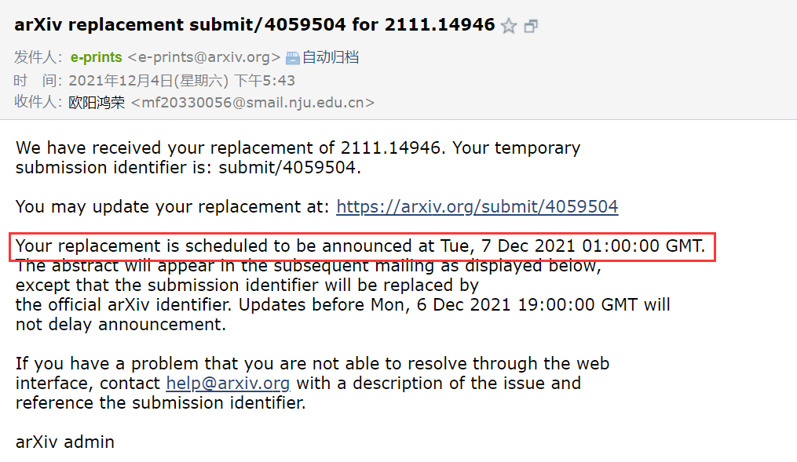
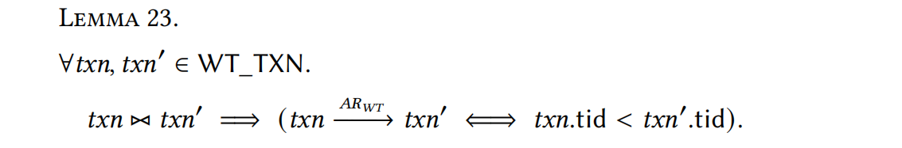

# MongoDB Snapshot Isolation Checker

This is the checker for our paper in [[2111.14946\] Verifying Transactional Consistency of MongoDB (arxiv.org)](https://arxiv.org/abs/2111.14946).

This project is responsible for **checking** whether a given execution history satisfies its corresponding snapshot isolation variant.

The input of our checker is a *directory* containing **real** execution histories to be checked, which is generated by the following project for different MongoDB deployments:

- **WiredTiger**(Standalone) deployment: [Jepsen Runner for WiredTiger](https://github.com/Tsunaou/wiredtiger-txn)
- **MongoDB replica set** and **sharded cluster** deployment: [Jepsen Runner for MongoDB](https://github.com/Tsunaou/mongodb)

## 0. Update 

- The version v0.2  with proof will be announced in arxiv at Tue, 7 Dec 2021 01:00:00 GMT.

  

## 1. Introduction

MongoDB is a popular general-purpose, document-oriented, distributed NoSQL database. It supports transactions in three different deployments: single-document transactions utilizing the WiredTiger storage engine in a standalone node, multi-document transactions in a replica set which consists of a primary node and several secondary nodes, and distributed transactions in a sharded cluster which is a group of multiple replica sets, among which data is sharded. A natural and fundamental question about MongoDB transactions is: 

**What transactional consistency guarantee do MongoDB Transactions in each deployment provide?** 

However, it lacks both concise pseudocode of MongoDB transactions in each deployment and formal specification of the consistency guarantees which MongoDB claimed to provide. 

In this work, we formally specify and verify the transactional consistency protocols of MongoDB. Specifically, 

- **We provide a concise pseudocode for the transactional consistency protocols** in each MongoDB deployment, namely WIREDTIGER, REPLICASET, and SHARDEDCLUSTER, based on the official documents and source code. 
- **We then prove that WIREDTIGER, REPLICASET, and SHARDEDCLUSTER satisfy different variants of snapshot isolation**, namely Strong-SI, Realtime-SI, and Session-SI, respectively.

**We also propose and evaluate efficient white-box checking algorithms for MongoDB transaction protocols against their consistency guarantees**, effectively circumventing the NP-hard obstacle in theory.

## 2. Configuration

### 2.1 Requirement

To run this project, you need to configure:

- Java 8 or higher
- Maven 3.8.2 (version in 3.6 could work but not suggested)

### 2.2 Build

This project is managed by maven and all dependencies can be found in pom.xml. You can build this project easily by 

```bash
mvn package
```

If you see `Build SUCCESS` as follows, you build this project successfully.

```bash
[INFO] ------------------------------------------------------------------------
[INFO] BUILD SUCCESS
[INFO] ------------------------------------------------------------------------
```

Then you can get a jar namely `MongoDB-SI-Checker-jar-with-dependencies.jar`，which is our checker for snapshot isolation. 

## 3. Getting started

You can check history by `MongoDB-SI-Checker-jar-with-dependencies.jar` you built, it takes 2 parameters:

- args[0]: history type(`WiredTiger` or `MongoDB`)
- args[1]: a url of a directory which stores the execution histories to be checked. 
  - Actually, it is the `store` directory collected by Jepsen test framework and it will be created after each jepsen testing. 
  - All you need to get this directory is just run test in [Jepsen Runner for WiredTiger](https://github.com/Tsunaou/wiredtiger-txn) or  [Jepsen Runner for MongoDB](https://github.com/Tsunaou/mongodb)

A history satisfies its corresponding variant of snapshot isolation if its ***INT*** and ***EXT*** property is checking successfully.

### 3.0 Paper Datasets

The original data of our paper can be found in:

- [Original Data(Execution History) of WiredTiger](https://box.nju.edu.cn/f/0573d5e252be443080bd/)

- [Original Data(Execution History) of MongoDB(replica set and sharded cluster)](https://box.nju.edu.cn/f/2568afa26ed74e799b03/)

Data for each Deployment is a zip file and **it can only unzip in Linux operation system.** If you failed to unzip them, it will be work in Linux environment such as Ubuntu.

### 3.1 Checking WiredTiger

#### How to run

The data of our paper of checking WiredTiger can be obtained in [Original Data(Execution History) of WiredTiger](https://box.nju.edu.cn/f/0573d5e252be443080bd/)  namely `wiredtiger-store-1131.zip`. It contains all histories executed by WiredTiger we checked which is mentioned in our paper. Suppose it is unzip into a path `/home/admin/wiredtiger-txn/store/`, you can check then by the following command:

```bash
./MongoDB-SI-Checker-jar-with-dependencies.jar WiredTiger /home/admin/wiredtiger-txn/store/
```

#### Standard output

If it works normally, the checking results will display to stdout and you can see like this: 

```bash
---------------------------------------------------------------------------------
Checking history for Strong-SI at /home/young/DisAlg/jepsen.wiredtiger/store/wiredtiger :rw-register time:20 txn-len:8/20211201T012305.000+0800/history.edn
[INFO] History is valid
[INFO] Checking INT Successfully
Calculation Relation.CommitBefore
Calculation Relation.ReturnBefore
Calculation Relation.ReadFrom
[INFO] 417 times of fixing in 13539 transactions
[INFO] The error scale is 0.015181242seconds
[INFO] Checking EXT Successfully
Cost 3244 ms
History Status: [count=19785, okCount=13539, failCount=0, infoCount=6246]
---------------------------------------------------------------------------------
Checking history for Strong-SI at /home/young/DisAlg/jepsen.wiredtiger/store/wiredtiger :rw-register time:20 txn-len:8/20211201T012106.000+0800/history.edn
[INFO] History is valid
[INFO] Checking INT Successfully
Calculation Relation.CommitBefore
Calculation Relation.ReturnBefore
Calculation Relation.ReadFrom
[INFO] 585 times of fixing in 11210 transactions
[INFO] The error scale is 0.04897192seconds
[INFO] Checking EXT Successfully
Cost 1700 ms
History Status: [count=20042, okCount=11210, failCount=0, infoCount=8832]
---------------------------------------------------------------------------------
```

The full output can be found in [`./reports/wiredtiger/1131-dell/1131-dell-output`]((https://github.com/Tsunaou/MongoDB-SI-Checker/blob/main/reports/wiredtiger/1131-dell/output-1131-dell)) of this repository.

#### Explanation

Take the output of checking first history as an example:

- It checks the history in `/home/young/DisAlg/jepsen.wiredtiger/store/wiredtiger :rw-register time:20 txn-len:8/20211201T012305.000+0800/history.edn`
- The history is valid (differentiated history and it is matched with the log file) 
- This history satisfies INT and EXT property
- In time error range **less than** 0.04897192 seconds, we correct the time error and construct appropriate VIS relation for checking and we correct 585 times among 11210 transactions.
- The checking takes a period of time in 1700 ms.
- In this execution, 20042 transaction are invoked and only 11210 successfully committed, 8832 transactions aborted.

#### Cross validation

Since the real-time clock we recorded is not strictly equal to the timestamp it really start or commit transaction, we use **tid relation**, which is proven, to correct it.



if you see a failed checking for EXT, it may caused by this incorrect real-time recording.  Here is an example: 

```bash
---------------------------------------------------------------------------------
Checking history for Strong-SI at /home/young/DisAlg/jepsen.wiredtiger/store/wiredtiger :rw-register time:30 txn-len:4/20211201T003942.000+0800/history.edn
[INFO] History is valid
[INFO] Checking INT Successfully
Calculation Relation.CommitBefore
Calculation Relation.ReturnBefore
Calculation Relation.ReadFrom
[INFO] 134 times of fixing in 29055 transactions
[INFO] The error scale is 0.004589154seconds
Checking for read (r 28 222) in [tid=3459, process=399, operations=[(w 27 235), (r 28 222)], startTimestamp=(4924880920,0), commitTimestamp=(4924986510,0);
[ERROR] Checking EXT Failed
Calculation Relation.TidBefore
[tid=3456, process=192, operations=[(w 28 220), (w 24 99)], startTimestamp=(4923502054,0), commitTimestamp=(4923923597,0);
[tid=3458, process=186, operations=[(w 28 221), (w 28 222), (w 27 234)], startTimestamp=(4923817180,0), commitTimestamp=(4923893385,0);
Exceptions.RelationInvalidException: Conflict with Lemma 10
Cost 11865 ms
History Status: [count=29990, okCount=29055, failCount=0, infoCount=935]
```

In this checking result, here is two transaction T1, T2:

- T1: `[tid=3456, commitTimestamp=(4923923597,0);`
- T2: `[tid=3458, commitTimestamp=(4923893385,0);`

They are conflict with LEMMA 23 so this EXT violation comes from incorrectly time recording and this checking result is meaningless, so we will discard this result.

### 3.2 Checking MongoDB

#### How to run

The data of our paper of checking MongoDB can be obtained in [Original Data(Execution History) of MongoDB(replica set and sharded cluster)](https://box.nju.edu.cn/f/2568afa26ed74e799b03/)  namely `mongodb-store-1129.zip`. It contains all histories executed by MongoDB replica set and sharded cluster we checked which is mentioned in our paper.

```bash
./MongoDB-SI-Checker-jar-with-dependencies.jar WiredTiger 
```

Suppose it is unzip into a path `/home/admin/mongodb/store/`, you can check then by the following command:

```bash
./MongoDB-SI-Checker-jar-with-dependencies.jar MongoDB /home/admin/mongodb/store/
```

#### Standard output

If it works normally, the checking results will display to stdout and you can see like this: 

```bash
---------------------------------------------------------------------------------
Checking history for Session-SI at /home/young/文档/store-1129/store/mongodb wr sharded-cluster w:majority time:120 timeout-txn:30 txn-len:12 r:majority tw:majority tr:snapshot partition/20211128T041308.000Z/history.edn
[INFO] History is valid
[INFO] Checking INT Successfully
Calculation Relation.CommitBefore
Calculation Relation.ReturnBefore
[INFO] Checking EXT Successfully
Cost 612 ms
History Status: [count=1384, okCount=1384, failCount=0, infoCount=0]
---------------------------------------------------------------------------------
Checking history for Session-SI at /home/young/文档/store-1129/store/mongodb wr sharded-cluster w:majority time:120 timeout-txn:30 txn-len:12 r:majority tw:majority tr:snapshot partition/20211127T110339.000Z/history.edn
[INFO] History is valid
[INFO] Checking INT Successfully
Calculation Relation.CommitBefore
Calculation Relation.ReturnBefore
[INFO] Checking EXT Successfully
Cost 417 ms
History Status: [count=2695, okCount=2695, failCount=0, infoCount=0]
```

The full output can be found in [`./reports/mongodb/1129-dell-opt/1129-dell-opt-output`](https://github.com/Tsunaou/MongoDB-SI-Checker/blob/main/reports/mongodb/1129-dell-opt/output-1129-dell-opt) of this repository.

The output is similar to that of checking WiredTiger so we will not explain the output here.

## 4. Conclusion and Future Work

In this paper, we have formally specified and verified the transactional consistency protocols in each MongoDB deployment, namely WiredTiger, ReplicaSet, and ShardedCluster. We proved that they satisfy different variants of snapshot isolation, namely StrongSI, RealtimeSI, and SessionSI, respectively. We have also proposed and evaluated efficient white-box checking algorithms for MongoDB transaction protocols against their consistency guarantees. Our work is a step towards formally verifying MongoDB, and creates plenty of opportunities for future research.

Our work is a step towards formally verifying MongoDB, and creates plenty of opportunities for future research. In the future, 

- We plan to verify and evaluate MongoDB Raft in the future work. 
- We will also explore the fault-tolerance and recovery mechanisms in distributed transactions. 
- It is interesting to explore the transactional consistency checking algorithms utilizing SMT solvers.

## 5. License

Copyright © 2021 Hongrong Ouyang

This program and the accompanying materials are made available under the terms of the Eclipse Public License v2.0 which is available at http://www.eclipse.org/legal/epl-2.0.

